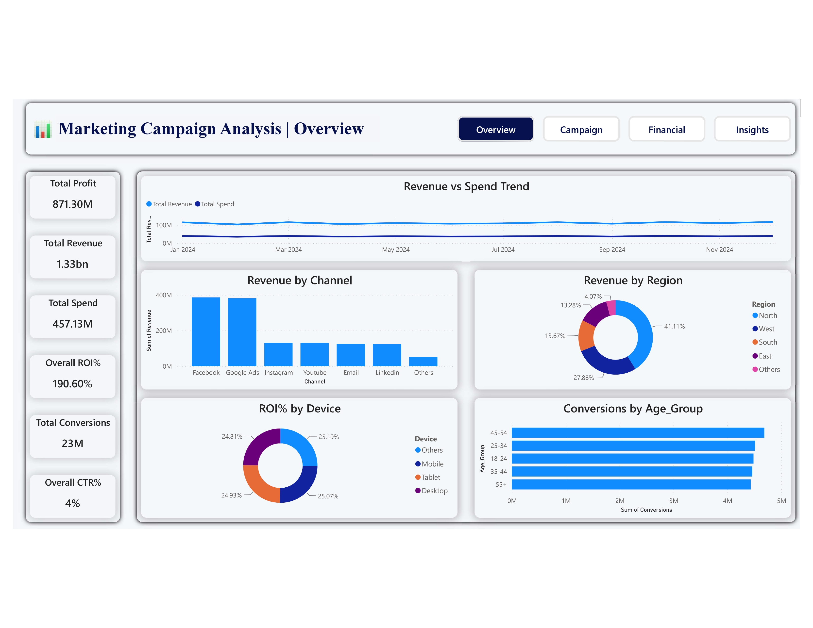
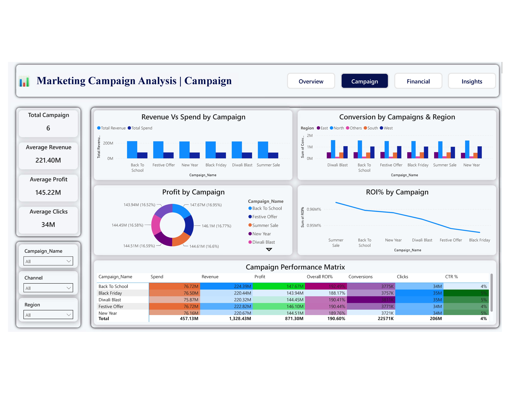
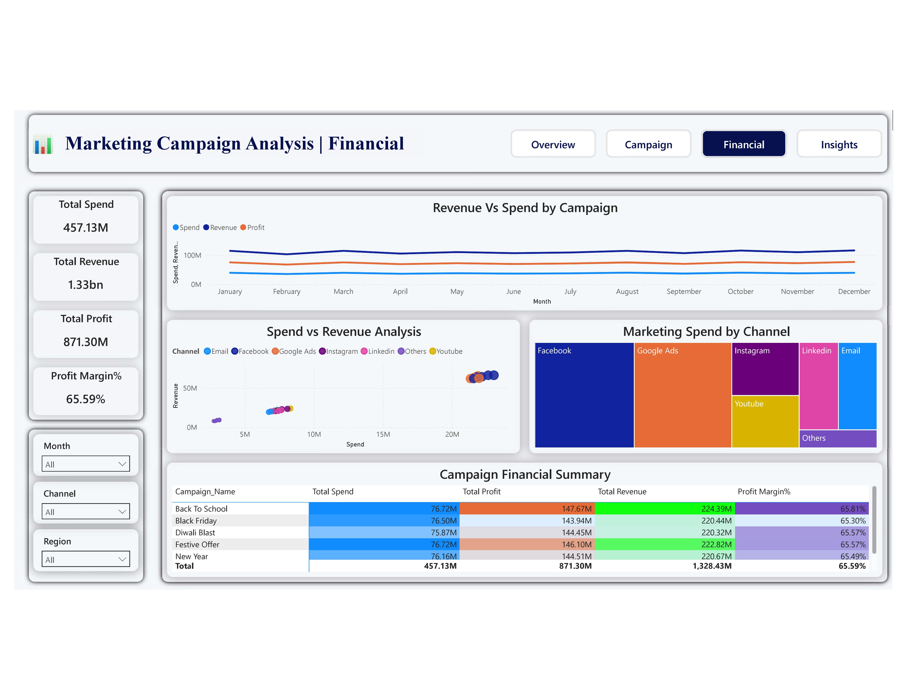
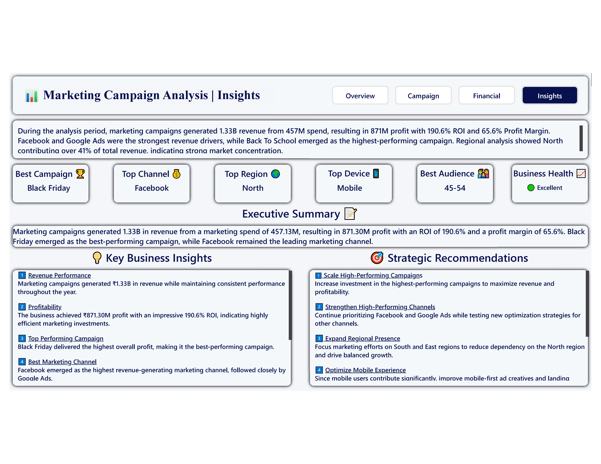

# 📊 End-to-End Marketing Campaign Analysis

An end-to-end **Data Analytics** project that analyzes marketing campaign performance using **Microsoft Excel, Python, and Microsoft Power BI**. The project demonstrates the complete analytics workflow, from raw data cleaning to business insights and interactive dashboard development.

---

## 📌 Table of Contents

- [Project Overview](#-project-overview)
- [Project Objectives](#-project-objectives)
- [Tech Stack](#-tech-stack)
- [Project Workflow](#-project-workflow)
- [Project Structure](#-project-structure)
- [Python Analysis](#-python-analysis)
- [Power BI Dashboard](#-power-bi-dashboard)
- [Key Business Insights](#-key-business-insights)
- [Business Recommendations](#-business-recommendations)
- [Dashboard Preview](#-dashboard-preview)
- [Python Visualizations](#-python-visualizations)
- [How to Run](#-how-to-run)
- [Future Improvements](#-future-improvements)
- [Connect With Me](#-connect-with-me)

---

# 📌 Project Overview

This project analyzes **30,000 marketing campaign records** to evaluate campaign performance across different marketing channels, regions, devices, customer age groups, and financial metrics.

The project follows a complete Data Analytics workflow:

- Data Cleaning
- Data Preparation
- Feature Engineering
- Exploratory Data Analysis (EDA)
- Dashboard Development
- Business Insights
- Strategic Recommendations

The objective is to transform raw marketing data into meaningful business insights that support data-driven decision-making.

---

# 🎯 Project Objectives

- Analyze overall marketing campaign performance.
- Measure Revenue, Spend, Profit, ROI, and Profit Margin.
- Identify top-performing campaigns and marketing channels.
- Analyze customer behavior across devices and age groups.
- Study revenue trends and campaign profitability.
- Generate business insights and actionable recommendations.

---

# 🛠️ Tech Stack

### Data Cleaning
- Microsoft Excel

### Data Analysis
- Python
- Pandas
- NumPy

### Data Visualization
- Matplotlib
- Seaborn

### Business Intelligence
- Microsoft Power BI
- DAX (Data Analysis Expressions)

---

# 🔄 Project Workflow

```text
Raw Dataset
      │
      ▼
Excel Data Cleaning
      │
      ▼
Python Data Cleaning
      │
      ▼
Feature Engineering
      │
      ▼
Exploratory Data Analysis (EDA)
      │
      ▼
Power BI Dashboard
      │
      ▼
Business Insights & Recommendations
```

---

# 📂 Project Structure

```text
Marketing-Campaign-Analysis/

│

├── Dashboard/
│   └── Marketing_Campaign_Analysis.pbix
│
├── Dataset/
│   ├── Marketing_Campaign_Cleaned_Final.xlsx
│   └── Marketing_Campaign_Messy_Dataset.csv
│
├── Documentation/
│   └── Marketing_Campaign_Analysis_Project_Documentation.docx
│
├── Images/
│
├── Python/
│   ├── Marketing_Campaign_Analysis.ipynb
│   ├── Marketing_Campaign_Final.csv
│   └── Marketing_Campaign_Messy_Dataset.csv
│
└── README.md
```

---

# 🐍 Python Analysis

The Python notebook includes:

### ✔ Data Understanding

- Dataset Overview
- Data Types
- Missing Values Analysis
- Statistical Summary

### ✔ Data Cleaning

- Missing Value Handling
- Duplicate Detection
- Data Type Conversion
- Text Standardization
- String Cleaning

### ✔ Feature Engineering

- Profit
- Profit Margin (%)
- ROI (%)
- CTR (%)
- Conversion Rate (%)
- Campaign Duration
- Month
- Month Number

### ✔ Exploratory Data Analysis

- Revenue Distribution
- Revenue by Channel
- Monthly Revenue Trend
- Spend vs Revenue Analysis
- Revenue Outlier Detection
- Correlation Heatmap
- Profit by Marketing Channel
- Device Performance
- Age Group Performance

### ✔ Business Insights

- Executive Summary
- Business Findings
- Strategic Recommendations

---

# 📊 Power BI Dashboard

The Power BI dashboard contains four interactive pages.

## 1️⃣ Executive Overview

- KPI Cards
- Revenue Trend
- Revenue by Channel
- Regional Performance

---

## 2️⃣ Campaign Performance

- Campaign Comparison
- ROI Analysis
- Conversion Analysis
- Campaign Performance Matrix

---

## 3️⃣ Financial Analysis

- Revenue vs Spend
- Profit Analysis
- Profit Margin
- Financial Summary

---

## 4️⃣ Business Insights

- Executive Summary
- Key Findings
- Recommendations
- Business Takeaways

---

# 📈 Key Business Insights

- Generated **₹1.33 Billion Revenue**
- Generated **₹871 Million Profit**
- Achieved **190.6% ROI**
- Profit Margin reached **65.59%**
- Marketing Spend and Revenue showed a strong positive correlation.
- Facebook emerged as one of the highest-performing marketing channels.
- Mobile users generated the highest customer engagement.
- High-revenue campaigns were identified through outlier analysis.

---

# 💡 Business Recommendations

- Increase investment in high-profit marketing channels.
- Allocate more budget to high-performing customer segments.
- Improve underperforming marketing campaigns.
- Continue optimizing mobile user experience.
- Monitor campaign profitability rather than revenue alone.
- Replicate strategies used by high-performing campaigns.
---

## 📷 Dashboard Preview

### Executive Overview



### Campaign Performance




### Financial Analysis




### Business Insights



---

# 📉 Python Visualizations

- Revenue Distribution
- Revenue by Channel
- Monthly Revenue Trend
- Spend vs Revenue
- Revenue Box Plot
- Correlation Heatmap
- Profit by Channel
- Device Analysis
- Age Group Analysis

---

# 🚀 Future Improvements

- Predict campaign performance using Machine Learning.
- Build an interactive Streamlit dashboard.
- Integrate real-time marketing campaign data.
- Perform customer segmentation using clustering.
- Build campaign performance forecasting models.

---

##  📬 Connect With Me

**LinkedIn**

https://www.linkedin.com/in/nishantsingh11

**GitHub**

https://github.com/nishantsingh71

---
